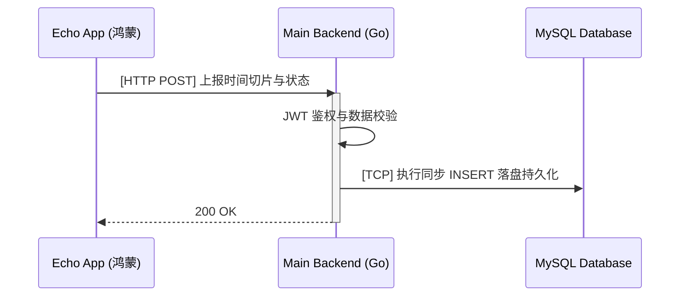
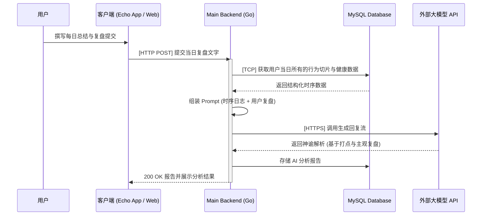

# 运行时视图 (Runtime View)

本节描绘了 Astrolabe 系统中最核心的两个动态运行时场景：高频数据上报与 AI 报告生成。

## 场景一：高频时间切片上报链路

移动终端产生的心跳记录、行为打点或体征数据，由应用统一提交并同步写入数据库，确保数据原子性与一致性。

## 场景二：每日用户复盘与 AI 神谕生成

在每日结束时，用户在客户端手动撰写夜间复盘，后端会提取当日的所有量化打点数据，结合用户的复盘文本，构建带上下文的 Prompt 发送给大模型，生成专属的深度分析报告。

